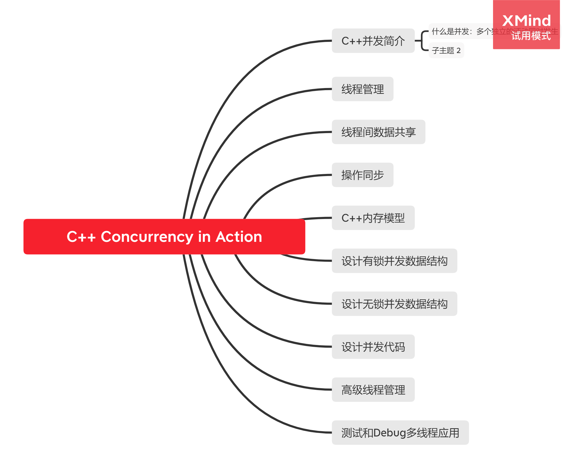

### C++ Concurrency in Action:Practical Multithreading

[C++ Concurrency in Action:Practical Multithreading](https://book.douban.com/subject/4130141/)一书由Anthony Williams所著，书中详细介绍了C++11标准库并发部份。

### 大纲

[思维导图源文件](https://github.com/hsuloong/reading-notes/tree/gh-pages-src/cplusplus-concurrency-in-action/imgs/cplusplus-concurrency-in-action-outline.xmind)


### 阅读日志

2020/08/16
```
1.完成整本书的略读
```

