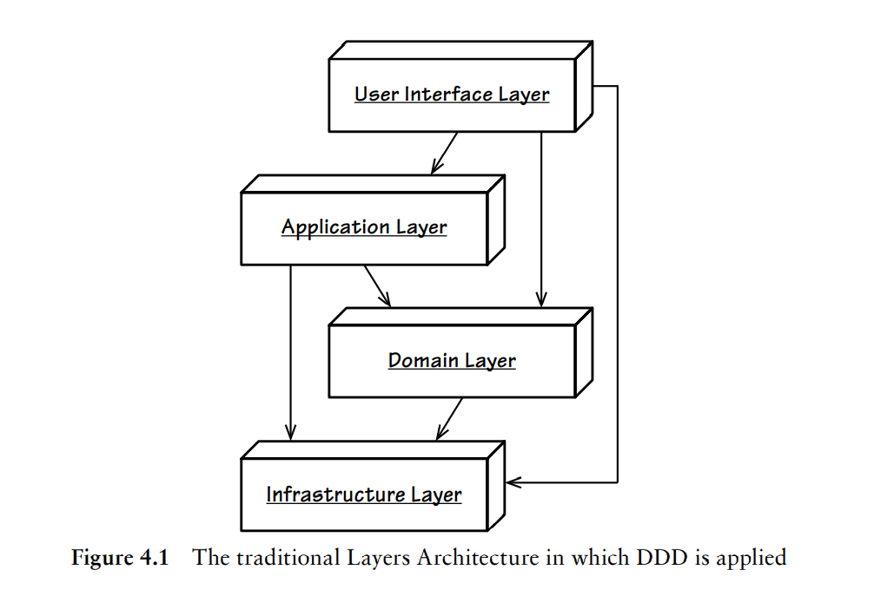
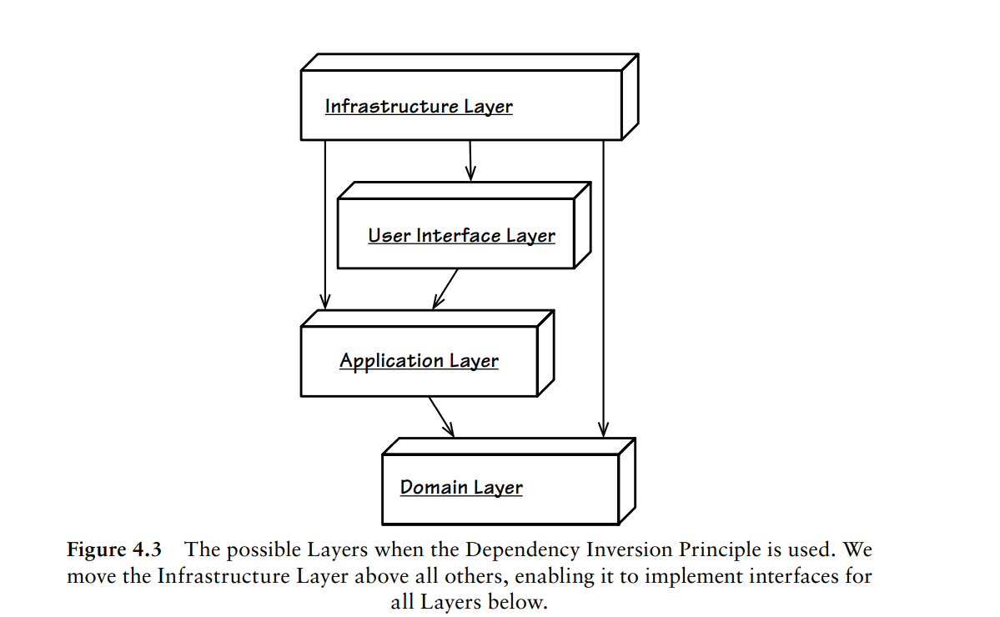
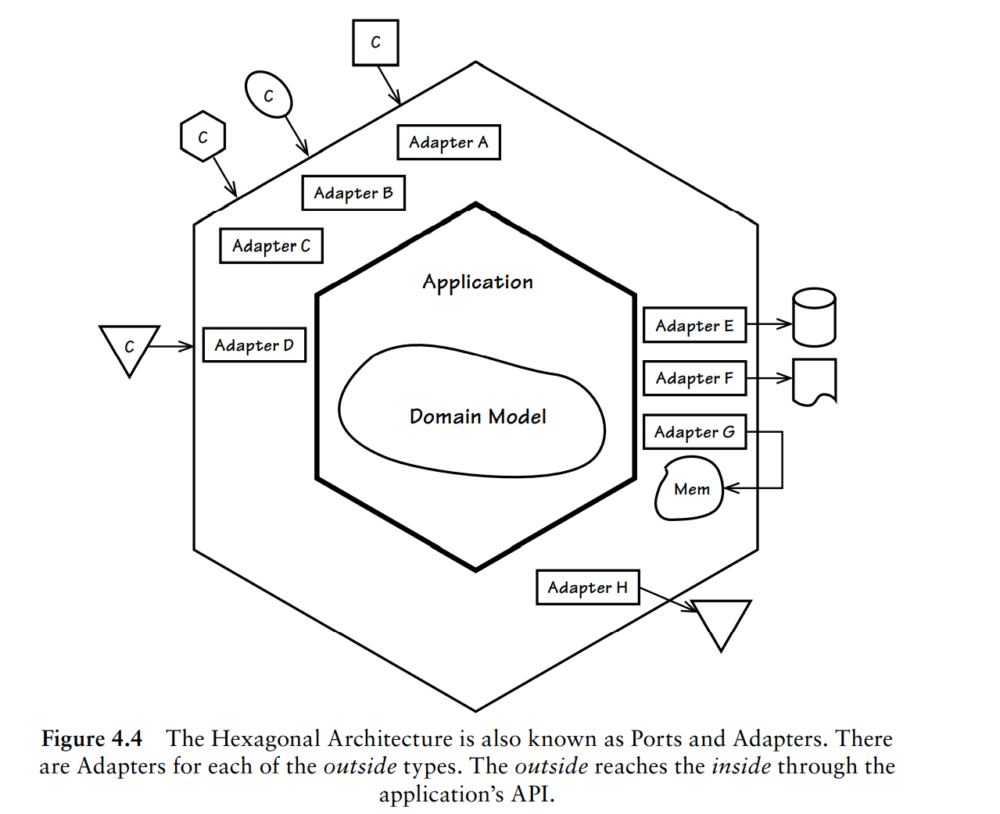
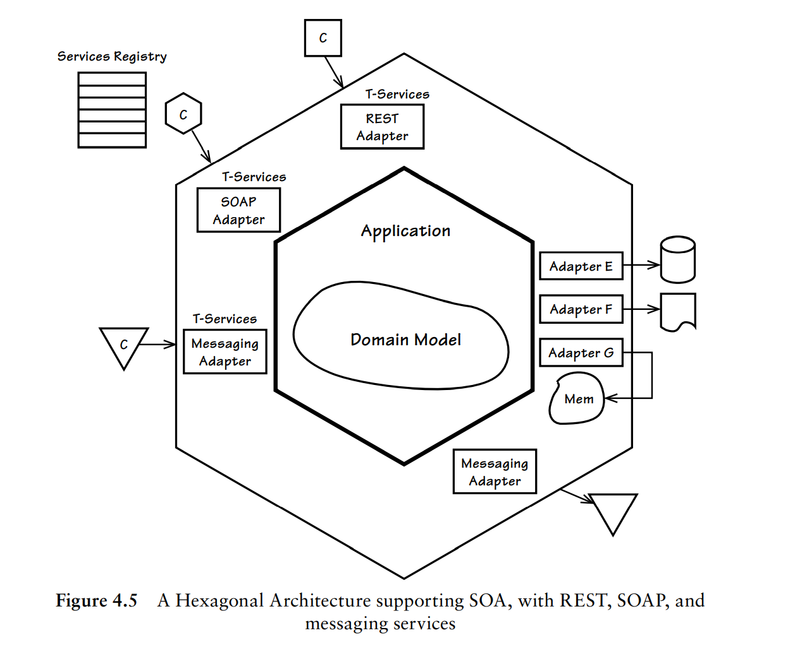

#### 架构(Architecture)

DDD实现并不需要特定的架构，因为其可以适用多种风格的架构。在选择具体的架构风格时，需要重点考虑软件质量。同时不要盲目使用架构，只有在能够降低项目失败风险才使用。

目前DDD已知使用比较多的架构主要有：

- 分层架构

- 六边形架构

- CQRS架构

#### 分层架构(The Layers Architecture)

分层架构在很多地方都有使用，比如后台经典的三层架构：接入层->Ao层->DAO层。

在分层架构中，高层只依赖比自己低的层，也就是每层只能与位于下方的层产生耦合。如下图为一个经典的DDD分层架构：

总共四层：

- 用户接口层(User Interface Layer)
  
用于处理用户显示和请求，不应该包含任何的领域或者业务逻辑。应用层是用户接口层的直接使用者。

- 应用层(Application Layer)

承载应用服务，也不应该出现领域逻辑。在应用层可以用于控制持久化事务和安全认证或者向其他系统发送基于事件的消息通知或者邮件。应用层本身虽然不处理业务逻辑，但是却是领域模型的直接使用者，可以协调领域对象的操作。

应用的行为可以归纳为：接受参数->通过资源库获取聚合实例->执行相应的命令。

要时刻记住，应用层是很薄的一层，如果很复杂，可能意味着领域逻辑泄漏到应用层了，将会导致产生贫血模型。

应用层也可以调用领域服务来完成相关的任务操作，但这些操作必须是无状态的。

- 领域层(Domain Layer)

- 基础设施层(Infrastructure Layer)

分层架构按照风格可以进一步分为：

- 严格分层架构(Strict Layers Architecture)

某层只能与直接位于下方的层发生耦合。

- 松散分层架构(Relaxed Layers Architecture)

允许某层与任意下方层发生耦合。

在实操中，由于用户接口层和应用层可能需要与基础设施打交道，所以很多都是松散分层架构。

#### 分层架构 + 依赖倒置(DIP)

在实现领域模型的时候，一般会尽量避免与基础设施层发生耦合。为了实现这个，[可以使用依赖倒置原则（Dependency Inversion Principle, DIP）](https://en.wikipedia.org/wiki/Dependency_inversion_principle)，DIP原则表述如下：

（1）高层次的模块不应该依赖于低层次的模块，两者都应该依赖于抽象接口。
（2）抽象接口不应该依赖于具体实现。而具体实现则应该依赖于抽象接口。

这两句话在具体代码实现中可以理解为：1.定义低层的抽象接口；2.低层继承实现该抽象接口；3.高层使用多态技术调用低层的实现。

依赖倒置后分层架构将会变成下图：

依赖倒置后，可以在领域层定义资源库的接口，然后在基础设施层实现，最后可以使用依赖注入技术来注入基础设施的实现。

#### 六边形架构（端口与适配器）(Hexagonal Or Ports and Adapter)

在分层架构使用依赖倒置技术+依赖注入技术以后，高层、低层都只依赖抽象，使得似乎抹平了分层的概念，也就是我们把分层架构推平了，这时候如果加上对称性，就会形成`六边形架构`了。

下图是六边形架构示意图：

六边形架构中，主要有内部区域和外部区域组成。内部区域用于处理外部区域的请求，外部区域则是提交请求输入。

#### 面向服务架构(Service-Oriented Architecture)

《实现领域驱动设计》一书中列出了一些面向服务架构的原则供参考：

如果将面向服务架构与六边形架构结合起来，将会得到如下架构图：

关于什么是面向服务架构，可以参考[Service-oriented architecture](https://en.wikipedia.org/wiki/Service-oriented_architecture)和[什么是面向服务的架构](https://www.redhat.com/zh/topics/cloud-native-apps/what-is-service-oriented-architecture)

#### REST架构(Representational State Transfer)

TODO

#### 命令和查询职责分离CQRS(Command-Query Responsibility Segregation)

TODO

#### 事件驱动架构(Event-Driven Architecture)

TODO