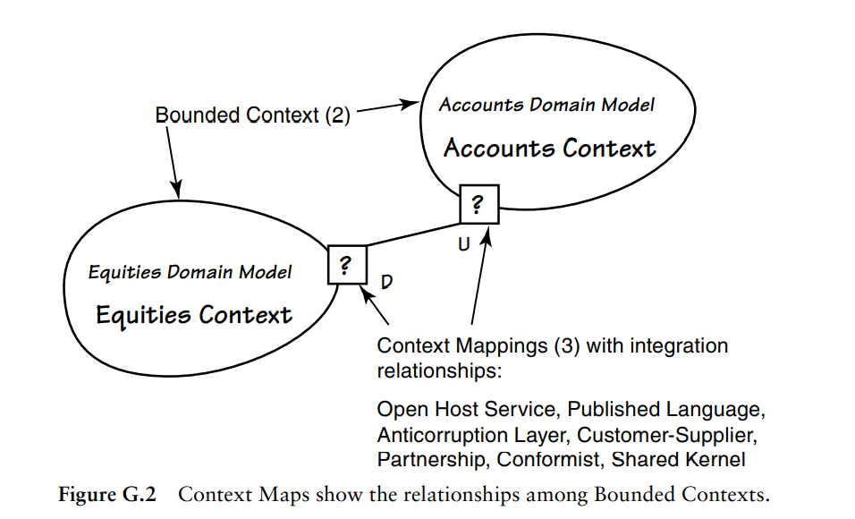
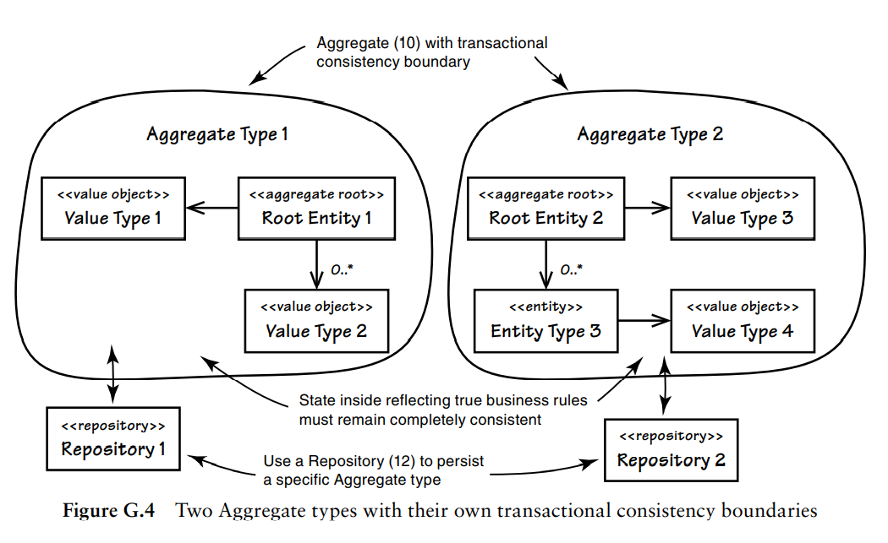
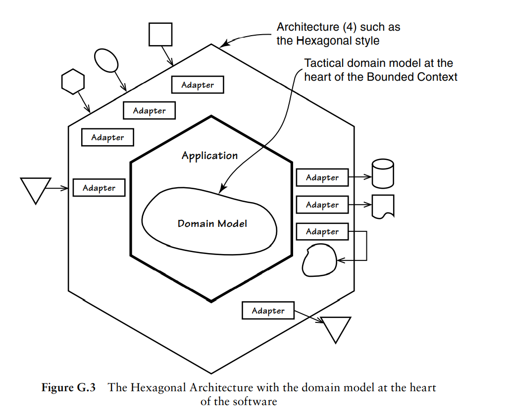

#### 初识领域驱动设计

在没有了解领域驱动设计之前，大部分业务开发的工作可能就是常见的`CRUD`。

基本代码步骤可能就是：接受请求->请求下游RPC->处理后返回。

这基本是一个纯面向过程式的代码风格，如果有多年业务开发经验的话，应该知道这里最大的问题是代码重复率高、可维护性差，因为大量的业务逻辑散落在各个地方了。

而这种面向过程式的代码风格也很容易导致另外一个问题：面向数据库编程。

可以回忆一下，在做需求设计的时候，很多人第一个想法就是先把数据库物理模型先设计出来，然后基于这个物理模型去实现业务逻辑。

而在`领域驱动设计`里面，设计物理模型并不是最高优先级，领域驱动设计更加关注`业务本身逻辑的设计`，因此领域驱动设计里面有诸如`战略建模`、`战术建模`、`限界上下文`、`通用语言`、`上下文映射图`、`领域`、`子域`、`聚合`、`实体`、`值对象`、`领域服务`等概念。

一句话：如果你希望自己的工作不总是`CRUD`，想开发出优雅整洁可快速迭代的业务系统，那么开始学领域驱动设计肯定不会让你失望的，领域驱动设计也可以帮你从更高的高度去思考业务。

#### 战略建模(Strategic Modeling)

战略建模主要包括设计`限界上下文`、`通用语言`、`上下文映射图`，用于帮助理清业务重要程度和哪些软件资产是可重新拿来使用的。

下图是《实现领域驱动设计》一书的`限界上下文`和`通用语言`一张示意图：

`限界上下文`是领域模型的边界，边界内的`通用语言`是清晰单一无歧义的。

在《实现领域驱动设计》一书中，作者曾说：

> 如果说Evans在软件开发社区有一项发明，那便是**通用语言**。可见通用语言在DDD中应当是一个需要重视的东西。

书中认为通用语言是一种协作模式，反映的是领域专家对于软件系统的思维模型，用于捕捉特定业务领域中的概念和术语。

一个特定的领域通过不同的名词、形容词和动词来表达软件模型，这些词汇（通用语言）也应当是开发团队正式使用的。

一般来说，`限界上下文`和`通用语言`是成对出现的，因为通用语言在一个限界上下文中的含义是唯一且明确的。

在一个特定的业务领域中，一般会划分出来多个限界上下文，为完成复杂的业务逻辑，他们需要集成在一起，如下示意图所示：

图中上下文之间的集成关系主要有：

(1) Open Host Service：开放主机服务

(2) Published Language：发布语言

(3) Anticorruption Layer：防腐层

(4) Customer-Supplier：客户方-供应方

(5) Partnership：合作关系

(6) Conformist：遵奉者

(7) Shared Kernel：共享内核

#### 战术建模(Tactical Modeling)

战术建模是基于某个限界上下文之中的，用于帮助创建DDD模型里面的各个部件，其有一个重要部件就是`聚合`。

聚合由实体、值对象组成，聚合需要在整个生命周期中保持事务一致。聚合实例通过`资源库Repository`进行持久化。

如下图为两个聚合：

聚合上面将会承载大部分的业务逻辑（通过调用实体或值对象的方法完成），如果有一些业务逻辑不适合出现在某个具体的实体或值对象中，则可以引入**无状态**的`领域服务`。领域服务可以操作多个聚合完成相应的业务逻辑。

而当聚合业务逻辑操作中发生重要事件时，可以通过`领域事件`来进行广播通知，领域事件由聚合来发布。

聚合在代码管理中又引入了`模块`的概念，《实现领域驱动》一书中用Java的包或者C#里面的命名空间来类比。

#### 架构(Architecture)

`战略建模`和`战术建模`应该是**架构中立**的，但是设计出来的领域模型之间则是存在架构。

比如：六边形(Hexagonal)架构、面向服务(Service-Oriented)架构、REST架构、事件驱动(Event-Driven)架构。

以下为《实现领域驱动》一书中关于DDD的六边形架构示意图：

#### DDD一些概念简介

- **领域模型**

    > It’s a software model of the very specific business domain you are working in. Often it’s implemented as an object model, where those objects have both data and behavior with literal and accurate business meaning. Creating a unique, carefully crafted domain model at the heart of a core, strategic application or subsystem is essential to practicing DDD. With DDD your domain models will tend to be smallish, very focused. Using DDD, you never try to model the whole business enterprise with a single, large domain model. Phew, that’s good!

    上面是引用《实现领域驱动》英文版的一段话，翻译成中文的意思是：领域模型是关于某个特定业务的软件模型，通常通过`对象模型`来实现，这些对象包含了数据和行为，并且表达了准确的业务含义。

- **贫血领域对象(Anemic Domain Model)**

    一个对象缺少行为（业务逻辑），而只有Setter/Getter函数。

- **对象-关系阻抗失配(Object-Relational Impedance Mismatch)**

    面向对象向传统关系型数据库存放数据存在表述不一致的问题。

- **贫血症导致的失忆症**

    贫血领域对象实现会导致业务意图不明确，最后丢失业务含义，称为失忆了。
