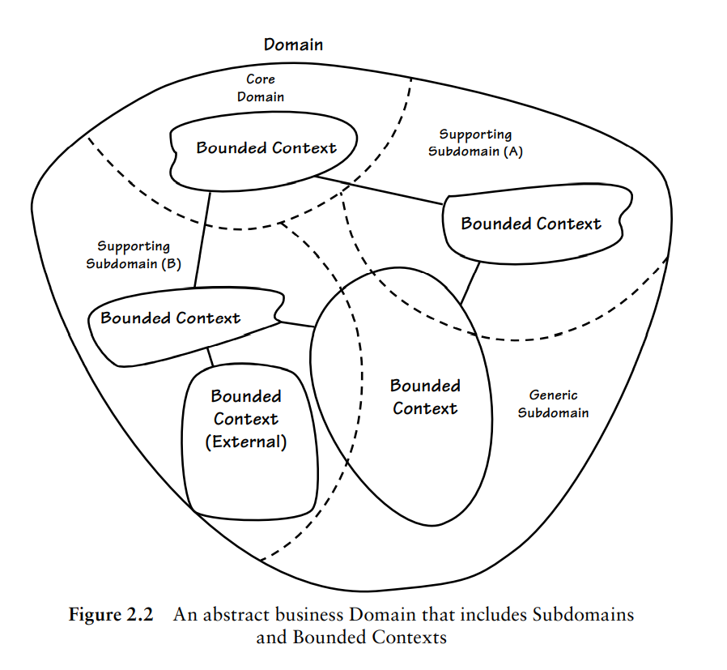
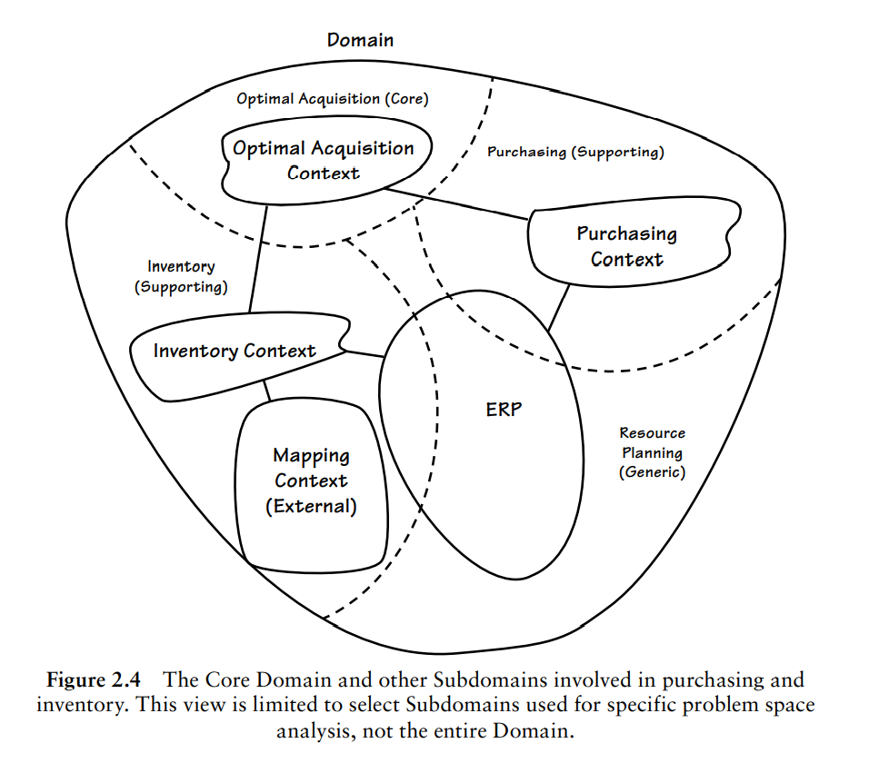
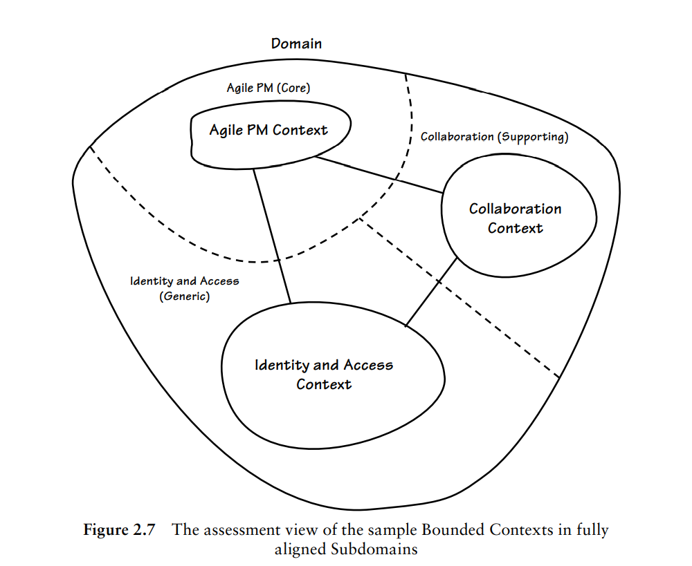
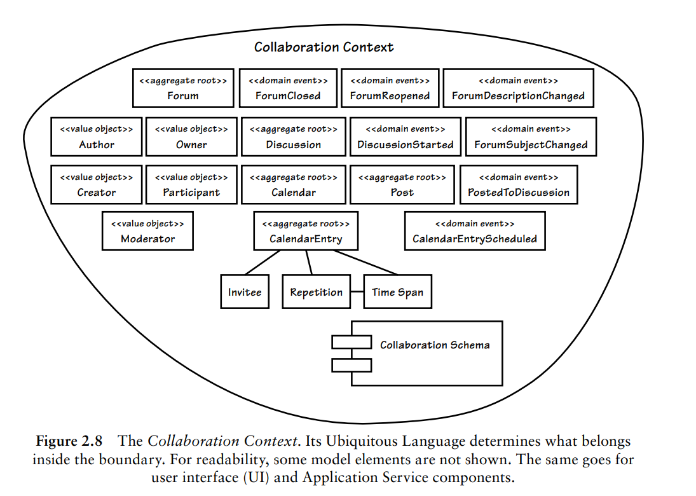
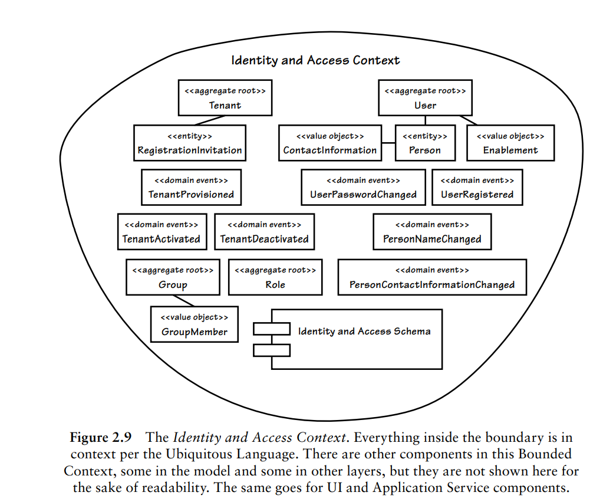
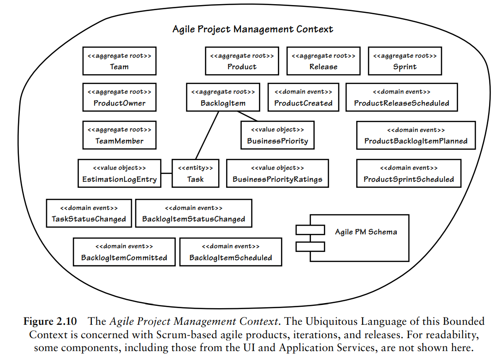
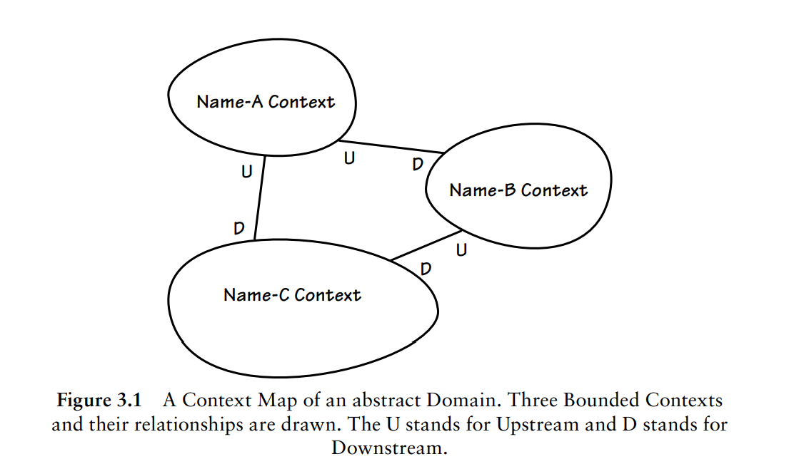
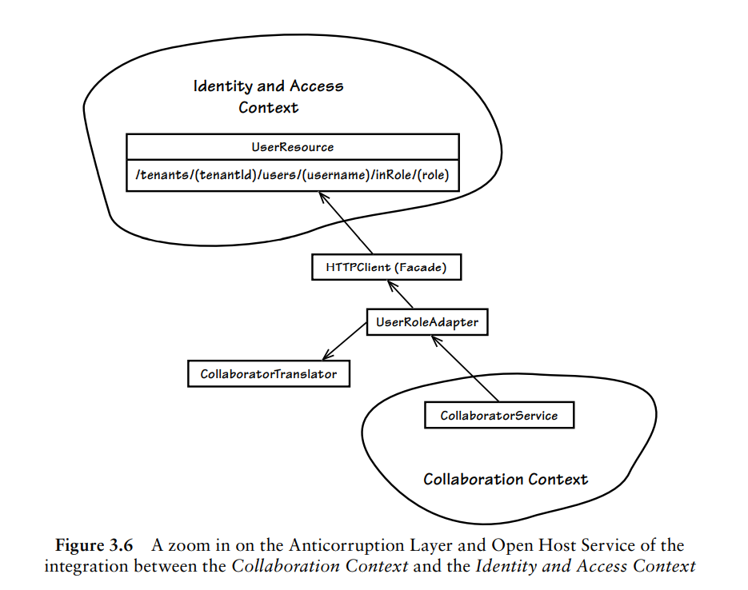

#### 战略建模(Strategic Modeling)

在学习战略建模之前，先理清几个概念：

- **领域(Domain)**

    广义上，领域是一个组织所做的事情及其所包含的一切，也就是一个组织的业务范围。比如腾讯的领域是社交，阿里的领域是电子商务。

    一个领域在DDD中会划分成多个子域，而`领域模型`则是在`限界上下文`中完成开发。

- **子域(Subdomain)**

    以《实现领域驱动设计》书中一个图为例，图中最大边界是一个`领域`，内部被划分成多个`子域`：

- **核心域(Core Domain)**

    具有最大业务价值的子域，通常是一个业务核心竞争力。

- **支撑子域(Supporting Subdomain)**

    支持业务但却不是核心域，那么就成为支撑子域，如果能够通用于整个业务系统，那么便成为`通用子域`。

- **通用子域(Generic Subdomain)**

    可以应用于整个业务系统，比如身份验证子域可能成为通用子域。

- **大泥球架构(Ball of Mud)**

    基本上所有难以维护、打补丁式优化的系统大概率是一个大泥球。这些软件系统杂乱无章、臃肿庞大。

- **问题空间(Problem Space)**

    问题空间是领域的一部分，是核心域和其他子域的组合。

- **解决方案空间(solution space)**

    解决方案空间包含一个或者多个限界上下文（一组特定软件模型），限界上下文可以理解为是一个特定的软件解决方案。

    一般而言尽量使得子域和限界上下文一对一对应，或者将多个限界上下文包含在一个子域中。如下图：

- **上下文映射图(Context Maps)**

    用于完成不同限界上下文的集成以及通用语言的映射。

- **限界上下文(Bounded Context)**

    > A Bounded Context is an explicit boundary within which a domain model exists. Inside the boundary all terms and phrases of the Ubiquitous Language have specific meaning, and the model reflects the Language with exactness.

    一个显式的边界，和通用语言一对一，领域模型存在于该边界之内。

    限界上下文并不是只包含领域模型，如果领域模型驱动着数据库Schema设计，那么数据库Schema也属于该上下文之中。有如果用户界面驱动着模型行为，该用户界面也属于上下文。

- **通用语言(Ubiquitous Language)**

    通用语言是整个团队共享的语言，团队内所有成员（包括领域专家和开发者）使用通用语言来交流。该语言是团队共同创建的公用语言，不一定非要采用工业标准术语。

最后《实现领域驱动设计》书中给出了SaasOvation团队战略设计后的结果，如下图：

#### 通用语言(Ubiquitous Language)

通用语言和限界上下文是战略建模最重要的组成，也是DDD的支柱，正如上面概念所说，两者是一对一的关系。

那么在日常实践中，怎么比较好的找出通用语言呢？以下是《实现领域驱动》一书中给出的方法：

- **绘制物理模型图和概念模型图，并标以名字和行为**

    这一步可以找到领域中的对象以及对象的行为，里面的术语可能就是通用语言。

- **创建一个简单定义的术语表**

    给你能想到的术语列一个表格，找出其中比较好以及不好的，慢慢形成合理的通用语言。

无论采用什么方法，通用语言的形成最重要的还是团队交流。

#### 限界上下文(Bounded Context)

限界上下文是一个显式的边界，领域模型存在于边界之内。在边界内，通用语言术语都有特定的含义，而领域模型则需要准确反映通用语言。

在实践中，不同限界上下文可能存在名字相同或者相近的对象，这种对象在不同的限界上上下文含义其实不完全一致。

比如以`账户`这个概念为例，账户可能在金融领域代表用户在金融公司的存款消费状态，而在博客领域则可能代表记录了一系列文章读写行为。

当开始集成上下文时，不同的概念需要进行映射，这些概念可能共用了一个唯一标识。

以微信为例：微信账户在消息领域可能会映射成消息发送者、消息接收者；在支付领域可能会映射成消费者；在公众号可能会映射成作者。这些概念都共用了一个唯一标识：微信号。

通常对于微服而言，一个限界上下文一般会在一个模块内实现，不过这个并不是强制，但至少要保证一个聚合内聚在一个模块中。

#### 上下文映射图(Context Map)

当开始采用DDD时，需要先绘制上下文映射图，该图包括所处业务项目的限界上下文以及集成关系。

图差不多长这个样子：

图中U(Upstream)代表上游，D(Downstream)代表下游。

在进行上下文集成的时候，上下文主要有这些集成关系：

- 合作关系(Partnership)

    两个限界上下文一荣俱荣，一损俱损，这时候会协调开发计划和集成管理，接口演化上同时满足两个系统的需求。

- 共享内核(Shared Kernel)

    共享模型和代码，需要多方协商一致来保证内核状态的稳定。

- 客户方-供应方(Customer-Supplier)

    两个团队处于上下游关系，且上游可以独立于下游完成开发，可能会导致下游团队的开发受到很大的影响。

- 遵奉者(Conformist)

    两个团队也是属于上下游的关系，但是上游没有动力提供下游所需时，下游只能盲目使用上游团队的模型。

- 防腐层(Anticorruption Layer)

    如果合作关系、共享内核、客户方-供应方关系无法顺利实现，会导致两个限界上下文之间的翻译沟通变得困难，此时可以通过防腐层来进行自己方的模型与他方模型的翻译转换。

    PS：可使用`ACL`来缩写。

- 开放主机服务(Open Host Service)

    定义协议，子系统通过协议来访问，比如RPC协议。

    PS：可使用`OHS`来缩写。

- 发布语言(Published Language)

    在两个限界上下文之间的一种公用的翻译语言，通过这个发布语言完成限界上下文之间的集成，一般会和开放主机服务一起使用。

    发布语言可以是`XML`、`Protocol Buffers`、`Json`等。

    PS：可使用`PL`来缩写。

- 另谋他路(Separate Ways)

    如果两个限界上下文不存在显著关系，那么就不进行集成。

- 大泥球(Big Ball of Mud)

    已有系统的模型可能是混乱不堪的，其边界非常模糊。此时应该为这个系统划定边界，这里面便是大泥球。此时不要试图通过复杂的建模手段来解决已有系统的问题，而是警惕这个系统会腐蚀其它系统。

下图是《实现领域驱动》书中例子的上下文映射图：

其中身份与访问上下文(Identity and Access Context)、协作上下文(Collaboration Context)是敏捷项目管理上下文(Agile Project Management Context)的上游，他们之间通过`开放主机服务+发布语言`以及`防腐层`进行集成。

下面是`身份与访问上下文`与协`作上下文集成`的示意图：

