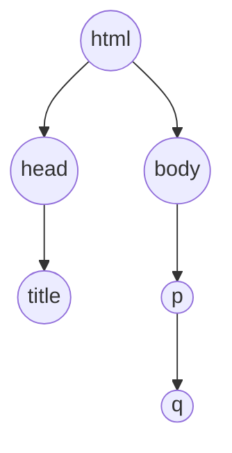

### 构建模块

- 可能的步骤：

```
1.根据内容设计HTML草图
2.创建HTML的基本构件模块(`<h1>、<h2>、<h3>、<p>等`)
3.将内容翻译成HTML
4.改进....
```

- 两个引用元素

```
1.<q>：主要用于短引用，有些浏览器会自动加上双引号，是一个内联元素
2.<blockquote>：主要用于长引用，浏览器会创建一个文本块并进行缩进，是一个块元素
```

- 块元素与内联元素：

```
表现上块元素“特立独行”，前后看上去都有换行；
内联元素则是“随波逐流”，出现在行内；
PS：<a>既可以是块元素也可以是内联元素，<br>则处于两者之间一个模糊地带
```

- 换行元素：`<br>`

- void元素：没有任何内容的元素，比如`<br>、`

- 列表元素：
```
1.<li>：用于包围列表内容，list item，是块元素
2.<ol>：包围<li>后代表有序列表，ordered list，是块元素
3.<ul>：包围<li>后代表无序列表,unordered list，是块元素
PS：<li>要与<ol>或ul成对出现，<li>用于标识每一个元素，<ol>/<ul>把内容归为一组，列表元素可以嵌套
```

- 嵌套

```
把一个元素放在另外一个元素中成为嵌套，嵌套关系可以形成一棵树
```


- 特殊字符

```
由于浏览器使用了<>标记，如果需要在内容里面插入则需要转义
比如'<'转义为'&gt;'，'>'转义为'&lt;'，'&'转义为'&amp;'
具体可参见：https://dev.w3.org/html5/html-author/charref 和 https://www.unicode.org/charts/
```

- 元素大杂烩

```
1.<code>：显式计算机程序代码
2.<time>：日期元素
3.<strong>：标记特别强调的文本
4.<pre>：按照输入的格式展示文本，会保留输入中的换行
```


