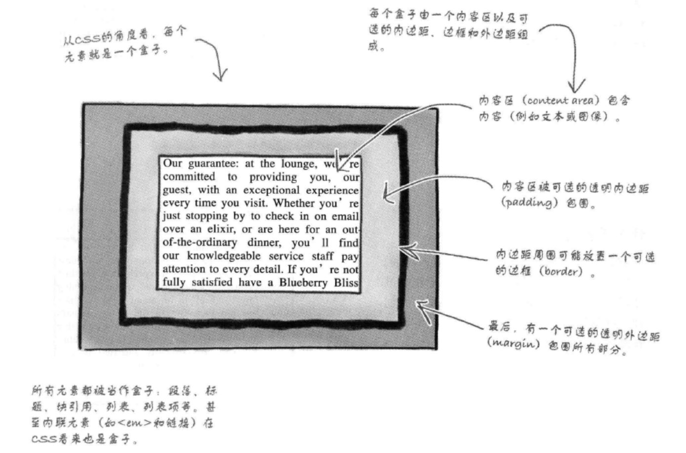

### 盒模型

- Box model



```
1.内容区：content area
2.内边距：padding
3.边框：border
4.外边距：margin

PS：内容-内边距-边框-外边距的夹心结构
```

- id选择器

```css
#guarantee {
    border-color: white;
    border-width: 1px;
    border-style: dashed;
    background-color: #a7cece;
    padding: 25px;
    padding-left: 80px;
    margin: 30px;
    margin-right: 250px;
    line-height: 1.9em;
    font-style: italic;
    color: #444444;
    font-family: Georgia, 'Times New Roman', Times, serif;
    background-image: url(./images/background.gif);
    background-repeat: no-repeat;
    background-position: top left;
}
/*
 * #号开头
*/
```

- 使用多个样式表 & 媒体查询

```html
<link type="text/css" rel="stylesheet" href="lounge1.css" media="screen and (max-device-width: 480px)">
<link type="text/css" rel="stylesheet" href="lounge2.css">
<link type="text/css" rel="stylesheet" href="lounge3.css">

<!--
 --  样式的顺序很重要，最下面的样式优先级最高
 -- media可以指定对于哪种设备生效
 -- 也可以在CSS使用 @media screen and (max-device-width: 480px) {/*具体CSS规则*/}的方式
 -- https://developer.mozilla.org/zh-CN/docs/Web/Guide/CSS/Media_queries
--> 
```