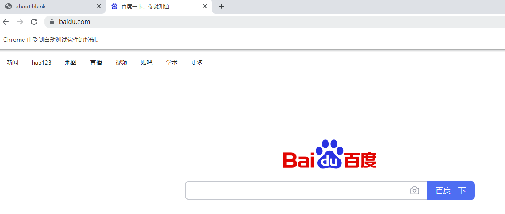
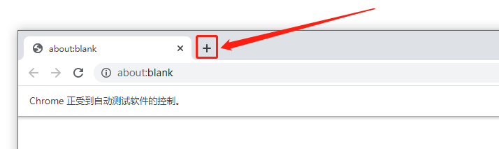
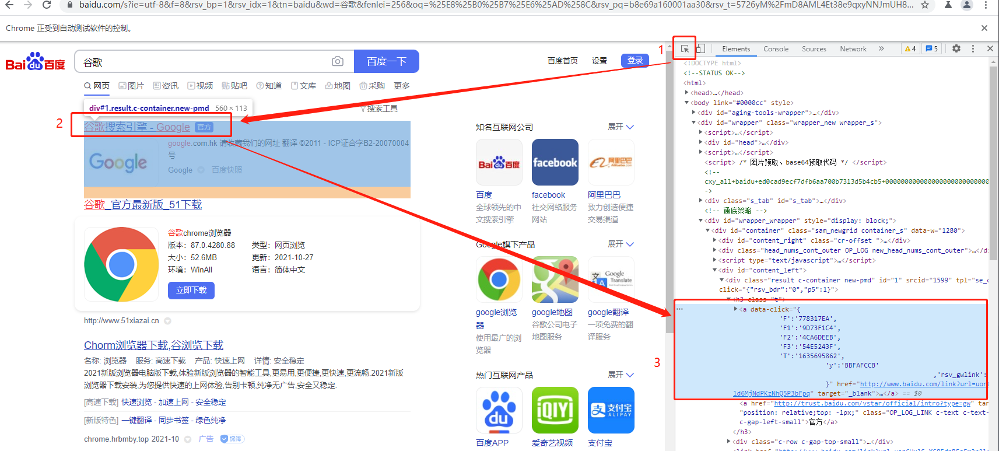
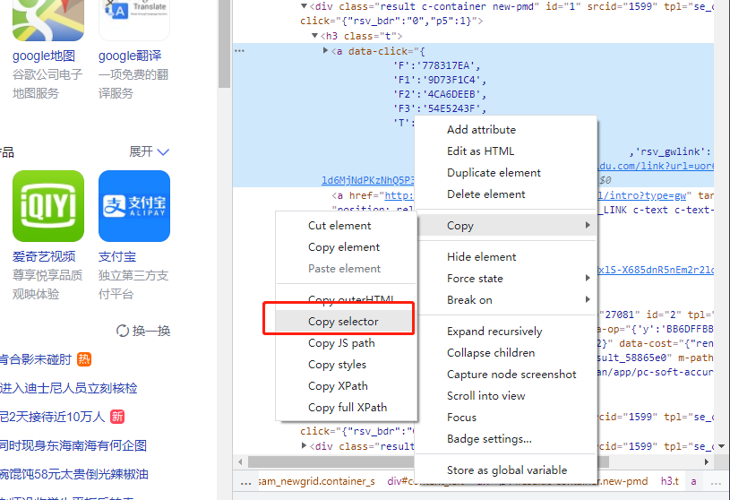

#### Puppeteer(自动化你的生活)

在学习先`Puppeteer`之前，我们先来看下`Puppeteer`的[官方定义](https://github.com/puppeteer/puppeteer)

>Puppeteer is a Node library which provides a high-level API to control Chrome or Chromium over the DevTools Protocol. Puppeteer runs headless by default, but can be configured to run full (non-headless) Chrome or Chromium.

如果把`Chrome`看作是一个系统，那么`DevTools Protocol`就是这个系统对外的API，而`Puppeteer`便是基于这些对外API包装出来的操作`Chrome`的一套易用工具库。

`Puppeteer`的中文翻译是`傀儡师`，如果仔细观察`Puppeteer`的图标，会发现很像一个被操作的木偶，这也完美诠释这个工具库的功能了：操作控制Chrome浏览器。


官方宣称，人可以在浏览器中做的事情，`Puppeteer`基本上也可以做。基于这一点，`Puppeteer`能做啥就看你的想象力，以下是官方举的几个例子：

>- Generate screenshots and PDFs of pages.
>- Crawl a SPA (Single-Page Application) and generate pre-rendered content (i.e. "SSR" (Server-Side Rendering)).
>- Automate form submission, UI testing, keyboard input, etc.
>- Create an up-to-date, automated testing environment. Run your tests directly in the latest version of Chrome using the latest JavaScript and browser features.
>- Capture a timeline trace of your site to help diagnose performance issues.
>- Test Chrome Extensions.

不管使用场景有哪些，他们核心的总是离不开一个词，那就是：`自动化`，也就是通过`Puppeteer`模拟人工操作行为，自动完成一些需要人工的操作，达到解放人类的目的。

好了，废话不多说，我们进入正式的使用上的学习。

首先是环境上的搭建，如果你编写过任何形式的`JavaScript`代码，那么应该了解`Node`和`npm`，不过如果你不了解也没关系，你只要从[这个页面](https://nodejs.org/zh-cn/download/)下载最新的`Node`，安装完成后整个环境就搭建完成了。验证是否成功可以拉起任意一个Bash终端，分别输入并运行下面两条指令

```
node -v
npm -v
```

只要能正确输出软件版本，就是安装成功了。

当然这里也推荐安装一下代码编写工具，这里我推荐[Visual Studio Code](https://code.visualstudio.com/)。

PS：笔者使用的是Windows，如果你用的是其他操作系统，安装方法应该类似，可以搜索以下相关教程，同时如果你也是使用Windows，建议你再安装一下[GitBash](https://git-scm.com/downloads)以替换原生Terminal。

接下来就是创建工程目录了，很简单，就下面几条指令(使用GitBash)：

```
cd  ~/
mkdir puppeteer_auto
cd puppeteer_auto
touch puppeteer_auto.js
npm init
npm i puppeteer
```

上面一些指令可能涉及到科学上网，相关知识请自行解决。附上一处地址供参考：[V2Ray](https://github.com/233boy/v2ray/wiki)

接下来请打开`puppeteer_auto.js`文件，输入以下内容：

```js
const puppeteer = require('puppeteer');

(async () => {
  const browser = await puppeteer.launch({args:['--no-sandbox', '--disable-setuid-sandbox'], headless:false, defaultViewport:null})
  const page = await browser.newPage();
  await page.goto('www.baidu.com');
})();
```

接下来执行
```
node puppeteer_auto.js
```

你将会看到电脑上弹出一个蓝色版的Chrome浏览器，差不多如下图所示：



分别解读一下上面一段代码的含义。

`const puppeteer = require('puppeteer');`用于引入`Puppeteer`库，这个是`NodeJs`的模块化语法，相关内容可参考[前端模块化的十年征程](https://zhuanlan.zhihu.com/p/265632724)


```js
(async () => {
    // ....
})();
```

这种形式被称作Js立即执行函数，具体内可参考[IIFE - 立即调用函数表达式](https://developer.mozilla.org/zh-CN/docs/Glossary/IIFE)，至于`async/await`则是用于异步编程，具体内容可以参考[async函数](https://developer.mozilla.org/zh-CN/docs/Web/JavaScript/Reference/Statements/async_function)。简单了解只需要知道这两点：1. 用`await`调用某个函数意味着进程暂停在这里并等待异步结果返回；2. 内部使用了`await`关键词的函数必须使用`async`修饰。


`await puppeteer.launch`用于打开一个浏览器，相当于你手动点击Chrome图标的操作，里面有一个重要的参数是`headless`，这个用于控制是否展示浏览器界面，因为实际上`Puppeteer`是可以后台静默运行的；`await browser.newPage();`相当于你点击了浏览器新加一个标签的加号：如下图：



`page.goto('www.baidu.com')`则是相当于你在地址栏输入网站链接后点击回车键后的动作。

在进一步学习更高级的操作之前，我们需要一些预备知识。由于`Puppeteer`API是分层次的，这些层次反映了浏览器结构，如下图([图源](https://pptr.dev/#?product=Puppeteer&version=v10.4.0&show=api-overview))：


- Puppeteer层：使用`DevTools`协议与浏览器进行通信。对应于[class Puppeteer](https://zhaoqize.github.io/puppeteer-api-zh_CN/#?product=Puppeteer&version=v10.4.0&show=api-class-puppeteer)
- Browser层：使用`puppeteer.launch`打开，拥有`BrowserContext`。每个BrowserContext可拥有多个`Page`。对应了[class Browser](https://zhaoqize.github.io/puppeteer-api-zh_CN/#?product=Puppeteer&version=v10.4.0&show=api-class-browser)
- Page层：使用`browser.newPage()`打开，至少含有一个主`Frame`，如果使用了HTML frame标签则可能有多个，一般只关心主Frame，其他可以在新的标签页打开。对应了[class Page](https://zhaoqize.github.io/puppeteer-api-zh_CN/#?product=Puppeteer&version=v10.4.0&show=api-class-page)
- Frame层，至少有一个默认的执行上下文，也就是`JavaScript`执行的环境。对应于[class Frame](https://zhaoqize.github.io/puppeteer-api-zh_CN/#?product=Puppeteer&version=v10.4.0&show=api-class-frame)

通常而言，与浏览器交互我们一般使用的工具是`鼠标`和`键盘`，鼠标主要是滚动和点击，键盘用于输入。而`Puppeteer`也有两个相应的类来对应，分别是`class: Keyboard`和`class Mouse`。


接下来，我们通过几个实例来学习更加高级的使用。

实例1：使用`谷歌`关键词在百度进行搜索，并打印第一个搜索结果。

```js
const puppeteer = require('puppeteer');

(async () => {
  const browser = await puppeteer.launch({args:['--no-sandbox', '--disable-setuid-sandbox'], headless:false, defaultViewport:null});
  const page = await browser.newPage();
  await page.goto('https://www.baidu.com/');
  const searchBar = '#kw';
  await page.type(searchBar, '谷歌');
  const searchButton = '#su';
  await page.click(searchButton);
  const firstResult = '#\\31 ';
  await page.waitForSelector(firstResult);
  console.log(await page.$eval(firstResult, el => el.innerHTML));
})();
```

上面就是全部实现代码，这里面涉及到简单DOM和CSS选择器知识，不过就算没学过也没事，这里我实例如何获取CSS选择器，如下图：



第1步：打开相应的页面并拉出控制台，一般是快捷键F12
第2步：点击图中序号1除的箭头符号，同时将鼠标移动到你需要获取选择器的内容上面，然后右边网页源码会自动高亮到相应的源码
第3步：右击源码高亮处，弹出如下图的页面，点击`Copy Selector`即可



上面提取到的`Selector`可以用于操作具体的页面的元素([HTML元素含义](https://developer.mozilla.org/zh-CN/docs/Web/HTML/Element)，简单可以理解为一块具体的内容)，比如模拟打字输入、单击鼠标等，相关的常用函数主要要有：

```js
page.$(selector) && page.$$(selector) // 获取一个或者多个HTML元素

 page.$eval(selector, pageFunction) && page.$$eval(selector, pageFunction) // 获取元素后传给用户自定义函数pageFunction，可以用于获取元素里面的一些具体内容

 page.click(selector) // 点击某个元素，比如按钮之类的鼠标可点击对象

 page.goto(url) // 打开一个新的页面

 page.type(selector, text) // 模拟输入文本

 page.waitForSelector(selector) // 等待元素选择器
```

更多的元素操作函数可以参考[class Page](https://zhaoqize.github.io/puppeteer-api-zh_CN/#?product=Puppeteer&version=v10.4.0&show=api-class-page)和[calss ElementHandle](https://zhaoqize.github.io/puppeteer-api-zh_CN/#?product=Puppeteer&version=v10.4.0&show=api-class-elementhandle)

如果没有基础的前端HTML/CSS/JavaScript知识会看起来很懵逼，不过没关系，如果你需要某个功能但是不知道怎么来做的时候可以借助于搜索引擎来搜索，只要你能理解上面`实例1`的那一段代码，你实际就算是入门`Puppeteer`了，剩下的就交给时间即可。


接下来我们来看一个更加复杂的实例。(TODO)


